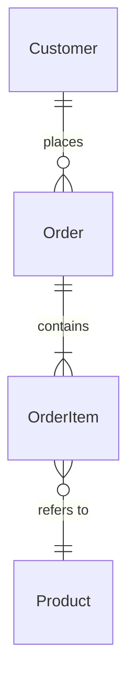

# Entity Model

> **Reminder**: This is a BUSINESS concept model, NOT a database schema. No primary keys, no SQL types, no foreign keys.

## Entities

<!--
Entities are the core "things" in your business domain.
Each entity should:
- Have identity (you can distinguish one from another)
- Be meaningful to business stakeholders
- Use business language, not technical jargon

Good entities: Customer, Order, Product, Invoice, Appointment
Bad entities: CustomerTable, OrderDTO, user_records, AuditLog (technical constructs)
-->

### [Entity Name]

**Description**:
<!--
What this entity represents in the business domain. Write for a business stakeholder.

Example:
"An Order represents a customer's commitment to purchase one or more products.
Orders progress through stages from initial placement to final delivery."
-->

**Attributes**:
<!--
Business-relevant properties only. Use natural language for types.

Good attributes:
- name - how the customer wishes to be addressed
- email - primary contact address
- status - current state (pending, confirmed, shipped, delivered)
- totalAmount - monetary value including tax and shipping
- orderDate - when the order was placed

Bad attributes:
- customer_id: INTEGER PRIMARY KEY AUTO_INCREMENT ← Database detail
- created_at: TIMESTAMP DEFAULT NOW() ← Technical audit field
- version: INT ← Optimistic locking (infrastructure)
- uuid: VARCHAR(36) ← Technical identifier format
-->

- [attribute] - [description]
- [attribute] - [description]

**Business Rules**:
<!--
Constraints that come from the business domain, not technical requirements.

Good rules:
- An Order must have at least one OrderItem
- OrderItem quantity must be positive
- Order cannot be modified after shipping
- Customer email must be unique

Bad rules:
- customer_id must be auto-incremented ← Database concern
- JSON must be valid ← Technical validation
-->

- [Constraint or rule]

---

### [Entity Name]

**Description**:

**Attributes**:
- [attribute] - [description]

**Business Rules**:
- [Constraint or rule]

---

## Relationships

<!--
How entities connect to each other. Use business verbs that stakeholders understand.
Always include cardinality (how many on each side).

Format: [Entity A] -- [verb] --> [Entity B] (cardinality)

Cardinality notation:
- 1:1 - exactly one to exactly one
- 1:n - one to many
- n:1 - many to one
- m:n - many to many
- 0..1 - zero or one (optional)
- 0..n - zero or more
- 1..n - one or more (at least one required)
-->

```
[Entity A] -- [verb] --> [Entity B] (cardinality)
```

<!--
Good relationship examples:
```
Customer -- places --> Order (1:n)
    "A customer may place many orders; each order belongs to exactly one customer"

Order -- contains --> OrderItem (1:n)
    "An order contains one or more items; each item belongs to exactly one order"

OrderItem -- refers to --> Product (n:1)
    "Each order item refers to exactly one product; a product may appear in many order items"

Product -- belongs to --> Category (n:1)
    "Each product belongs to one category; a category contains many products"

Product -- tagged with --> Tag (m:n)
    "A product may have many tags; a tag may apply to many products"
```

Bad relationship examples:
```
Customer -- Order (has_many through: customer_orders) ← ORM syntax
Order -- belongs_to --> Customer ← Framework terminology
orders.customer_id --> customers.id ← Database foreign key
```
-->

### Relationship Diagram

<!--
Optional: Include a simple ASCII or Mermaid diagram for complex models.

Example (ASCII):
```
┌──────────┐     places      ┌───────┐    contains    ┌───────────┐
│ Customer │ ──────────────> │ Order │ ─────────────> │ OrderItem │
└──────────┘      1:n        └───────┘      1:n       └───────────┘
                                                            │
                                                            │ refers to
                                                            │ n:1
                                                            ▼
                                                      ┌─────────┐
                                                      │ Product │
                                                      └─────────┘
```

Example (Mermaid):

-->

---

## Glossary

<!--
Define domain terms that might be ambiguous or have specific meaning in this context.
Include terms that non-domain-experts might misunderstand.

Good glossary entries define BUSINESS meaning:
| Order | A customer's commitment to purchase. Distinct from "quote" (non-binding) |
| Fulfilment | The process of picking, packing, and shipping ordered items |
| Backorder | Order accepted but awaiting inventory replenishment |

Bad glossary entries:
| API | Application Programming Interface ← Generic technical term
| Database | Where data is stored ← Not domain-specific
| UUID | Universally Unique Identifier ← Implementation detail
-->

| Term | Definition |
|------|------------|
| [Term] | [What it means in THIS business domain] |
| [Term] | [What it means in THIS business domain] |

---

## Entity States

<!--
Optional: Document valid states and transitions for entities with lifecycle.

Example for Order:
```
[Draft] --> [Pending] --> [Confirmed] --> [Shipped] --> [Delivered]
                │              │              │
                ▼              ▼              ▼
           [Cancelled]    [Cancelled]    [Returned]
```

State descriptions:
- Draft: Customer is still building the order
- Pending: Order submitted, awaiting payment confirmation
- Confirmed: Payment received, ready for fulfilment
- Shipped: Order has left the warehouse
- Delivered: Customer has received the order
- Cancelled: Order terminated before shipment
- Returned: Customer returned the order after delivery
-->
