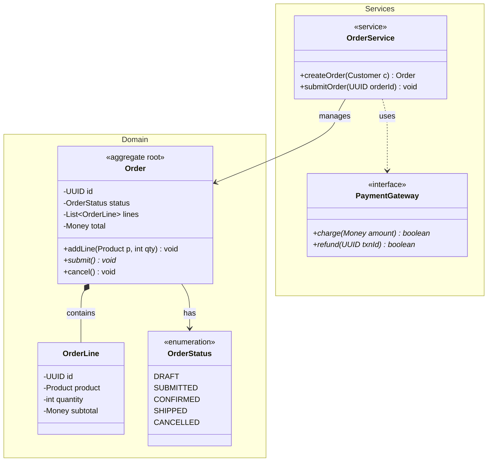
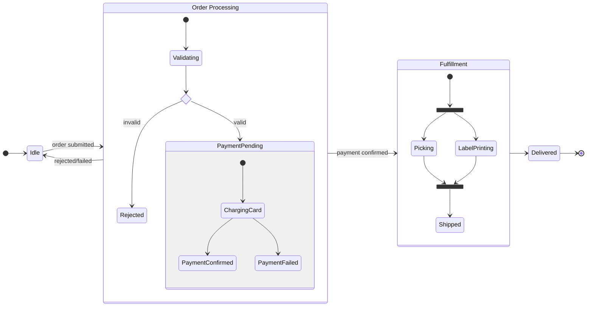
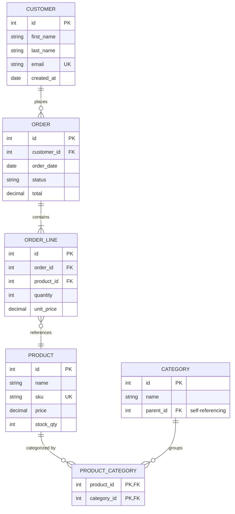

# Class, State, and ER Diagram Reference

## Contents
- [Class Diagram](#class-diagram)
- [State Diagram](#state-diagram)
- [Entity Relationship Diagram](#entity-relationship-diagram)

---

# Class Diagram

## Declaration

```
classDiagram
```

## Class Definition

```
class Animal {
    +String name
    +int age
    #List~String~ tags
    -UUID id
    +getName() String
    +setName(String name) void
    #validate()* void
    +getInstance()$ Animal
}
```

**Visibility:** `+` Public, `-` Private, `#` Protected, `~` Package/Internal

**Method classifiers** (after return type): `*` Abstract, `$` Static

**Generics**: Use tildes: `List~String~`, `Map~String, List~int~~`

## Annotations

```
class Shape {
    <<interface>>
}
class Color {
    <<enumeration>>
    RED
    GREEN
    BLUE
}
```

Types: `<<interface>>`, `<<abstract>>`, `<<service>>`, `<<enumeration>>`

## Class Labels

```
class BankAccount["Bank Account with spaces"]
```

## Relationships

| Type | Syntax | Description |
|------|--------|-------------|
| Inheritance | `A <\|-- B` | B extends A |
| Composition | `A *-- B` | B is part of A (strong) |
| Aggregation | `A o-- B` | B belongs to A (weak) |
| Association | `A --> B` | A uses B |
| Solid link | `A -- B` | Related |
| Dependency | `A ..> B` | A depends on B |
| Realization | `A ..\|> B` | B implements A |
| Dashed link | `A .. B` | Loosely related |

**Bidirectional**: `A <\|..\|> B`

**Lollipop interfaces**: `A ()-- B` or `B --() A`

**Labels**: `A --> B : uses`

**Cardinality**: `A "1" --> "*" B : has`, `A "0..1" --> "1..*" B`

## Namespaces

```
namespace Payments {
    class PaymentProcessor
    class Invoice
}
```

## Notes

```
note "General note"
note for ClassName "Specific note"
```

## Direction

`direction TB`, `BT`, `LR`, `RL`

## Styling

```
classDef highlight fill:#f96,stroke:#333,stroke-width:2px
class Animal highlight
Animal:::highlight
```

Config: `hideEmptyMembersBox: true`

## Example



---

# State Diagram

## Declaration

```
stateDiagram-v2
```

Use `stateDiagram-v2` (preferred over legacy `stateDiagram`).

## States

```
StateId
state "Long description" as StateId
StateId : Description added after
```

## Start and End

```
[*] --> FirstState
LastState --> [*]
```

`[*]` is start or end depending on arrow direction.

## Transitions

```
State1 --> State2
State1 --> State2 : trigger / action
```

## Composite (Nested) States

```
state Active {
    [*] --> Processing
    Processing --> Validating
    Validating --> [*]
}
```

Multiple nesting levels supported.

## Choice

```
state check <<choice>>
[*] --> check
check --> Approved : amount < 1000
check --> NeedsReview : amount >= 1000
```

## Fork and Join

```
state fork_state <<fork>>
state join_state <<join>>
[*] --> fork_state
fork_state --> TaskA
fork_state --> TaskB
TaskA --> join_state
TaskB --> join_state
join_state --> Done
```

## Concurrency

```
state Parallel {
    [*] --> DownloadingData
    --
    [*] --> RenderingUI
}
```

`--` separator creates concurrent regions.

## Notes

```
note right of Active
    This is a note about
    the Active state
end note
note left of Idle : Short note
```

## Direction

`direction LR`, `TB`, `BT`, `RL`. Can be set globally or per composite state.

## Styling

```
classDef alert fill:#f00,color:#fff,font-weight:bold
class Error alert
```

**Limitations**: Cannot style `[*]` start/end or composite states directly.

## Example



---

# Entity Relationship Diagram

## Declaration

```
erDiagram
```

## Relationship Syntax

```
ENTITY1 ||--o{ ENTITY2 : "relationship label"
```

Format: `ENTITY1 [cardinality][line][cardinality] ENTITY2 : label`

## Cardinality Markers

| Left | Right | Meaning |
|------|-------|---------|
| `\|o` | `o\|` | Zero or one |
| `\|\|` | `\|\|` | Exactly one |
| `}o` | `o{` | Zero or more |
| `}\|` | `\|{` | One or more |

## Line Types

- `--` Solid (identifying relationship: child depends on parent)
- `..` Dashed (non-identifying: entities exist independently)

## Entity Attributes

```
CUSTOMER {
    int id PK
    string name
    string email UK
    int address_id FK
    string phone PK,FK "customer primary phone"
}
```

Format: `type name [keys] ["comment"]`. Keys: `PK`, `FK`, `UK`. Combine: `PK,FK`.

## Entity Aliases

```
CUSTOMER ["Customer Account"] {
    ...
}
```

## Direction

```
erDiagram
    direction LR
```

## Styling

```
classDef highlight fill:#f9f,stroke:#333
CUSTOMER:::highlight
style CUSTOMER fill:#bbf,stroke:#333
```

## Example


