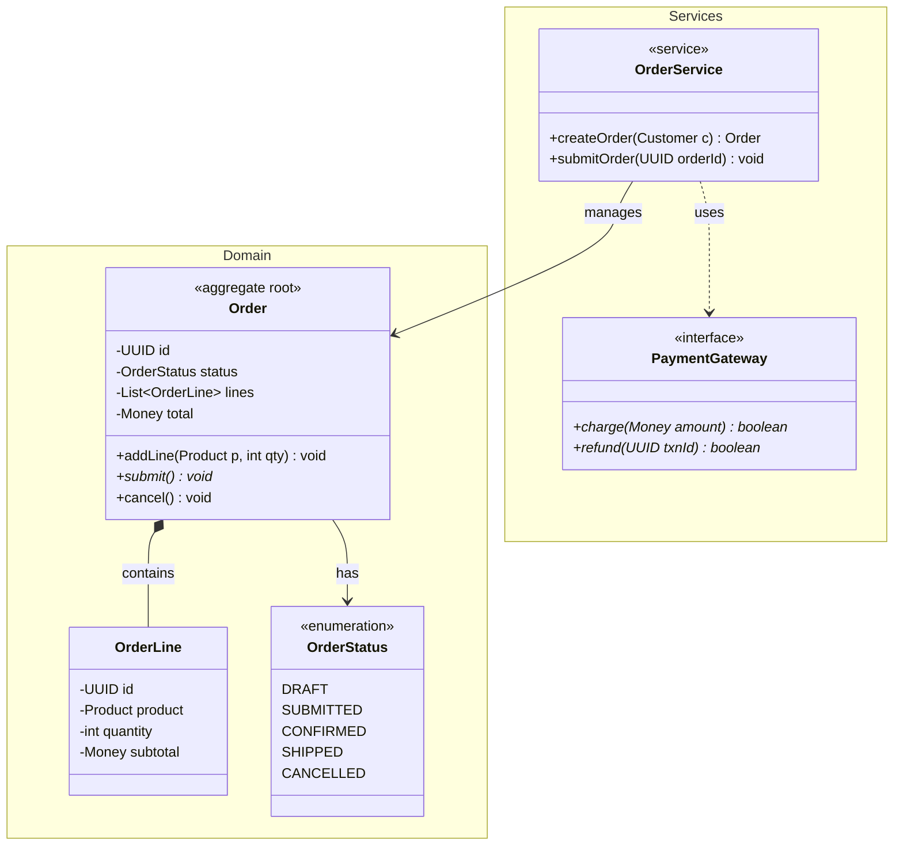
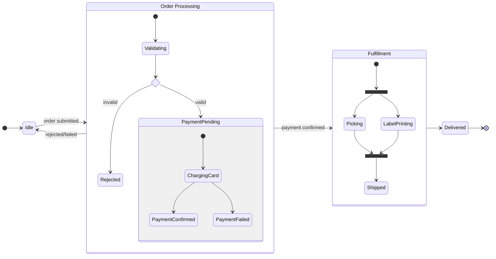
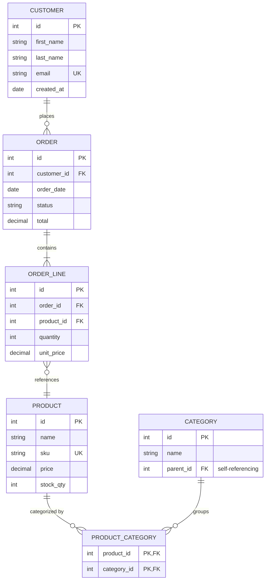

# Class, State, and ER Diagram Reference

## Contents
- [Class Diagram](#class-diagram)
- [State Diagram](#state-diagram)
- [Entity Relationship Diagram](#entity-relationship-diagram)

---

# Class Diagram

## Declaration

```
classDiagram
```

## Class Definition

```
class Animal {
    +String name
    +int age
    #List~String~ tags
    -UUID id
    +getName() String
    +setName(String name) void
    #validate()* void
    +getInstance()$ Animal
}
```

**Visibility:** `+` Public, `-` Private, `#` Protected, `~` Package/Internal

**Method classifiers** (after return type): `*` Abstract, `$` Static

**Generics**: Use tildes: `List~String~`, `Map~String, List~int~~`

## Annotations

```
class Shape {
    <<interface>>
}
class Color {
    <<enumeration>>
    RED
    GREEN
    BLUE
}
```

Types: `<<interface>>`, `<<abstract>>`, `<<service>>`, `<<enumeration>>`

## Class Labels

```
class BankAccount["Bank Account with spaces"]
```

## Relationships

| Type | Syntax | Description |
|------|--------|-------------|
| Inheritance | `A <\|-- B` | B extends A |
| Composition | `A *-- B` | B is part of A (strong) |
| Aggregation | `A o-- B` | B belongs to A (weak) |
| Association | `A --> B` | A uses B |
| Solid link | `A -- B` | Related |
| Dependency | `A ..> B` | A depends on B |
| Realization | `A ..\|> B` | B implements A |
| Dashed link | `A .. B` | Loosely related |

**Bidirectional**: `A <\|..\|> B`

**Lollipop interfaces**: `A ()-- B` or `B --() A`

**Labels**: `A --> B : uses`

**Cardinality**: `A "1" --> "*" B : has`, `A "0..1" --> "1..*" B`

## Namespaces

```
namespace Payments {
    class PaymentProcessor
    class Invoice
}
```

## Notes

```
note "General note"
note for ClassName "Specific note"
```

## Direction

`direction TB`, `BT`, `LR`, `RL`

## Styling

```
classDef highlight fill:#f96,stroke:#333,stroke-width:2px
class Animal highlight
Animal:::highlight
```

Config: `hideEmptyMembersBox: true`

## Example


```mermaid
classDiagram
    direction TB
    namespace Domain {
        class Order {
            <<aggregate root>>
            -UUID id
            -OrderStatus status
            -List~OrderLine~ lines
            -Money total
            +addLine(Product p, int qty) void
            +submit()* void
            +cancel() void
        }
        class OrderLine {
            -UUID id
            -Product product
            -int quantity
            -Money subtotal
        }
        class OrderStatus {
            <<enumeration>>
            DRAFT
            SUBMITTED
            CONFIRMED
            SHIPPED
            CANCELLED
        }
    }
    namespace Services {
        class OrderService {
            <<service>>
            +createOrder(Customer c) Order
            +submitOrder(UUID orderId) void
        }
        class PaymentGateway {
            <<interface>>
            +charge(Money amount)* boolean
            +refund(UUID txnId)* boolean
        }
    }

    Order *-- OrderLine : contains
    Order --> OrderStatus : has
    OrderService --> Order : manages
    OrderService ..> PaymentGateway : uses
```

---

# State Diagram

## Declaration

```
stateDiagram-v2
```

Use `stateDiagram-v2` (preferred over legacy `stateDiagram`).

## States

```
StateId
state "Long description" as StateId
StateId : Description added after
```

## Start and End

```
[*] --> FirstState
LastState --> [*]
```

`[*]` is start or end depending on arrow direction.

## Transitions

```
State1 --> State2
State1 --> State2 : trigger / action
```

## Composite (Nested) States

```
state Active {
    [*] --> Processing
    Processing --> Validating
    Validating --> [*]
}
```

Multiple nesting levels supported.

## Choice

```
state check <<choice>>
[*] --> check
check --> Approved : amount < 1000
check --> NeedsReview : amount >= 1000
```

## Fork and Join

```
state fork_state <<fork>>
state join_state <<join>>
[*] --> fork_state
fork_state --> TaskA
fork_state --> TaskB
TaskA --> join_state
TaskB --> join_state
join_state --> Done
```

## Concurrency

```
state Parallel {
    [*] --> DownloadingData
    --
    [*] --> RenderingUI
}
```

`--` separator creates concurrent regions.

## Notes

```
note right of Active
    This is a note about
    the Active state
end note
note left of Idle : Short note
```

## Direction

`direction LR`, `TB`, `BT`, `RL`. Can be set globally or per composite state.

## Styling

```
classDef alert fill:#f00,color:#fff,font-weight:bold
class Error alert
```

**Limitations**: Cannot style `[*]` start/end or composite states directly.

## Example


```mermaid
stateDiagram-v2
    direction LR
    [*] --> Idle

    state "Order Processing" as Processing {
        direction TB
        [*] --> Validating
        state validation_check <<choice>>
        Validating --> validation_check
        validation_check --> PaymentPending : valid
        validation_check --> Rejected : invalid

        state PaymentPending {
            [*] --> ChargingCard
            ChargingCard --> PaymentConfirmed
            ChargingCard --> PaymentFailed
        }
    }

    Idle --> Processing : order submitted
    Processing --> Fulfillment : payment confirmed
    Processing --> Idle : rejected/failed

    state Fulfillment {
        state fork_ship <<fork>>
        state join_ship <<join>>
        [*] --> fork_ship
        fork_ship --> Picking
        fork_ship --> LabelPrinting
        Picking --> join_ship
        LabelPrinting --> join_ship
        join_ship --> Shipped
    }

    Fulfillment --> Delivered
    Delivered --> [*]
```

## State vs Transition: The Branching Rule

When modelling workflows or orchestration loops, the temptation is to give every step its own state box (activity-diagram style). This reads like a procedure but bloats the diagram with boxes that aren't really states. Apply this rule to decide:

**A step is a state if it blocks or branches. Otherwise it's a transition action on an arrow.**

| Question | Yes → | No → |
|----------|-------|------|
| Does the system block here waiting for a result? | State | Check next |
| Can this step produce multiple outcomes? | State | Transition action |

- **One outcome, instant** → label it on the arrow with `/ action` syntax: `StateA --> StateB : trigger / action`
- **Multiple outcomes OR blocking** → it needs a state box so you can attach outgoing arrows for each outcome

### Examples

```
%% BAD: "Committing docs" is a box, but it always succeeds and is instant
state "Committing doc changes" as s_docs
a_pm_lint --> s_docs
s_docs --> a_dev

%% GOOD: collapse to a transition action label
a_pm_lint --> a_dev : / commit docs
```

```
%% GOOD: git merge genuinely branches 3 ways — it deserves a state
state "Merging origin/main" as s_merge
state merge_ok <<choice>>
s_merge --> merge_ok
merge_ok --> s_done : clean
merge_ok --> a_dev : dirty tree
merge_ok --> a_conflicts : conflict
```

### Audit checklist for workflow state diagrams

After drafting, walk every state and ask:

1. **Does the system wait here?** (agent running, polling, subprocess) → keep as state.
2. **Can it fail or branch?** (pre-commit hook rejects, merge conflicts, test pass/fail) → keep as state.
3. **Is it single-outcome glue?** (`git add --all`, increment counter, close ticket) → collapse onto the arrow as `/ action`.

Duration is a red herring — a 10ms step that can fail needs a state; a 5-second step that always succeeds doesn't.

---

# Entity Relationship Diagram

## Declaration

```
erDiagram
```

## Relationship Syntax

```
ENTITY1 ||--o{ ENTITY2 : "relationship label"
```

Format: `ENTITY1 [cardinality][line][cardinality] ENTITY2 : label`

## Cardinality Markers

| Left | Right | Meaning |
|------|-------|---------|
| `\|o` | `o\|` | Zero or one |
| `\|\|` | `\|\|` | Exactly one |
| `}o` | `o{` | Zero or more |
| `}\|` | `\|{` | One or more |

## Line Types

- `--` Solid (identifying relationship: child depends on parent)
- `..` Dashed (non-identifying: entities exist independently)

## Entity Attributes

```
CUSTOMER {
    int id PK
    string name
    string email UK
    int address_id FK
    string phone PK,FK "customer primary phone"
}
```

Format: `type name [keys] ["comment"]`. Keys: `PK`, `FK`, `UK`. Combine: `PK,FK`.

## Entity Aliases

```
CUSTOMER ["Customer Account"] {
    ...
}
```

## Direction

```
erDiagram
    direction LR
```

## Styling

```
classDef highlight fill:#f9f,stroke:#333
CUSTOMER:::highlight
style CUSTOMER fill:#bbf,stroke:#333
```

## Example


```mermaid
erDiagram
    CUSTOMER ||--o{ ORDER : places
    CUSTOMER {
        int id PK
        string first_name
        string last_name
        string email UK
        date created_at
    }

    ORDER ||--|{ ORDER_LINE : contains
    ORDER {
        int id PK
        int customer_id FK
        date order_date
        string status
        decimal total
    }

    ORDER_LINE }o--|| PRODUCT : references
    ORDER_LINE {
        int id PK
        int order_id FK
        int product_id FK
        int quantity
        decimal unit_price
    }

    PRODUCT ||--o{ PRODUCT_CATEGORY : "categorized by"
    PRODUCT {
        int id PK
        string name
        string sku UK
        decimal price
        int stock_qty
    }

    CATEGORY ||--o{ PRODUCT_CATEGORY : groups
    CATEGORY {
        int id PK
        string name
        int parent_id FK "self-referencing"
    }

    PRODUCT_CATEGORY {
        int product_id PK,FK
        int category_id PK,FK
    }
```
