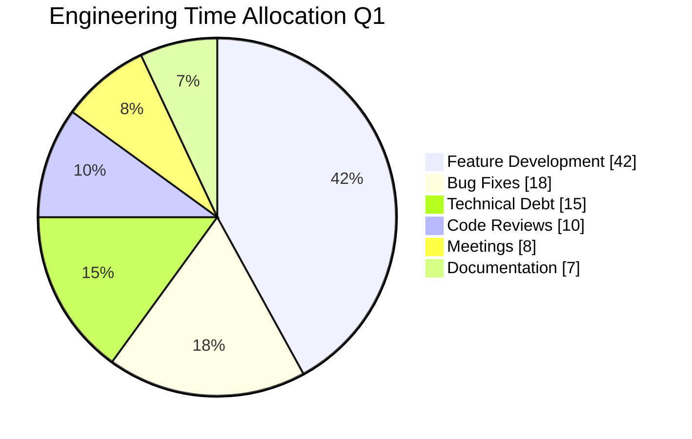
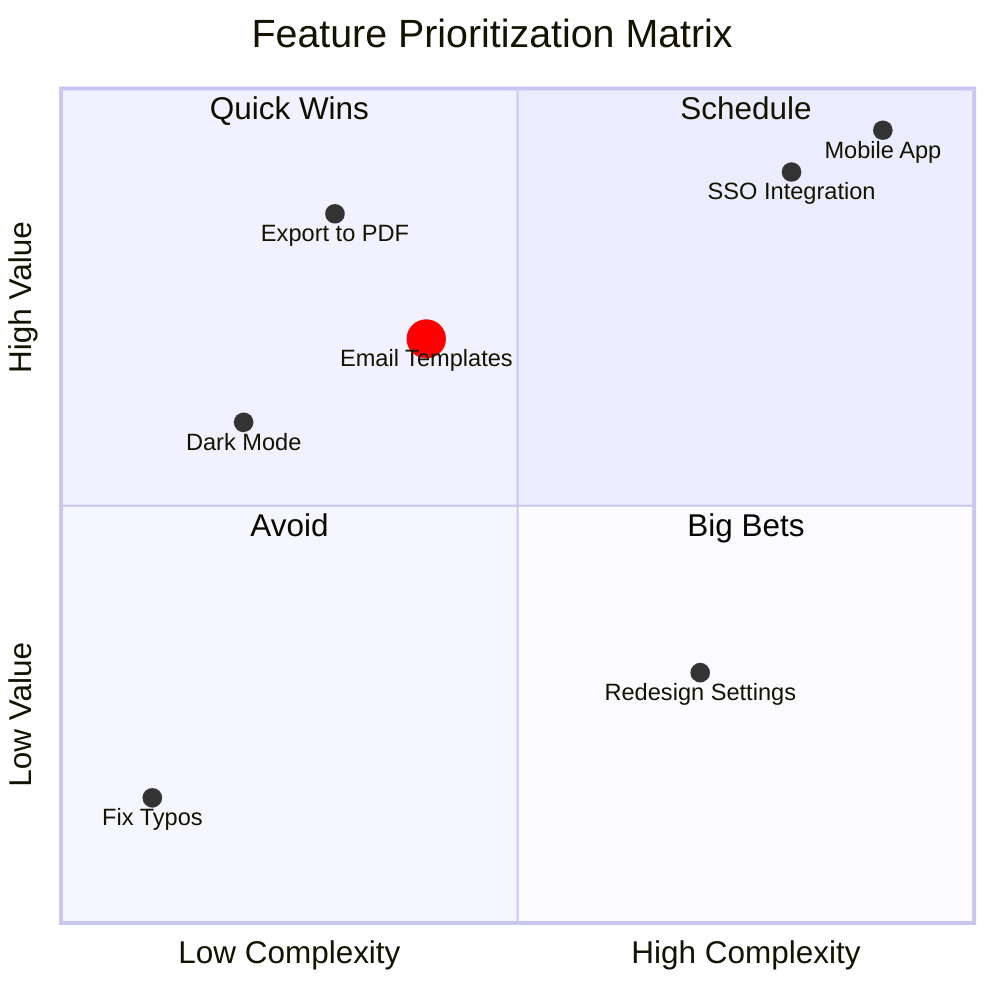
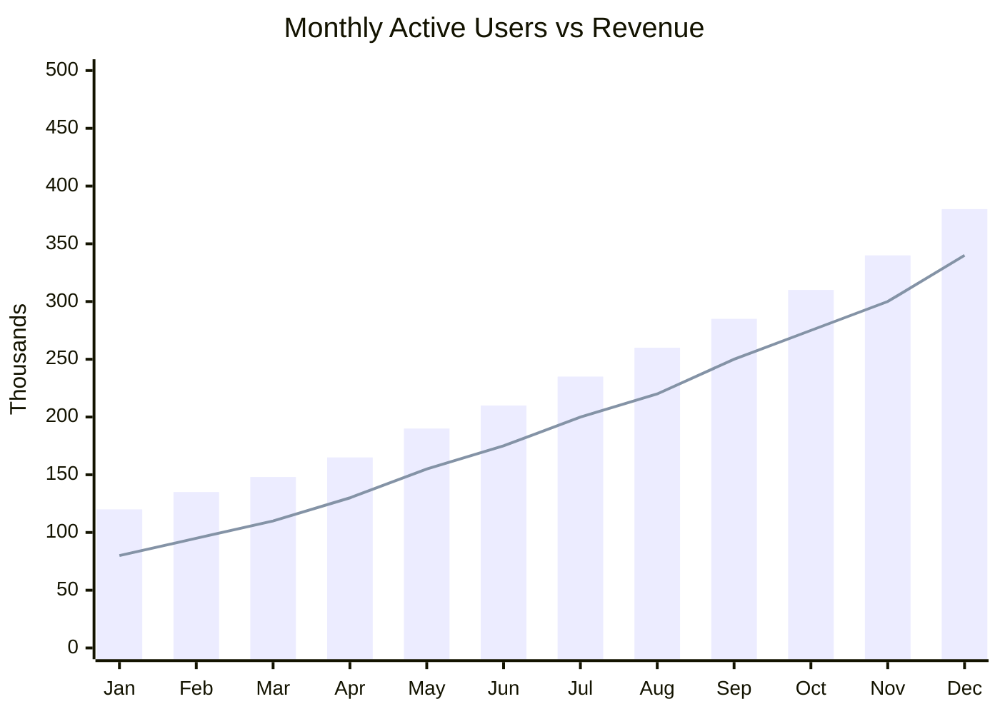
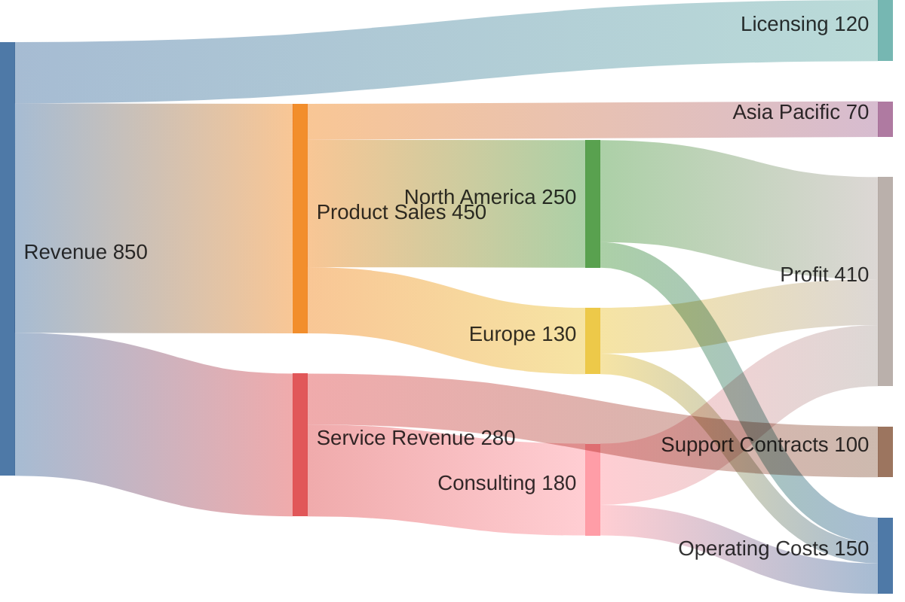

# Data Visualization Diagrams Reference

## Contents
- [Pie Chart](#pie-chart)
- [Quadrant Chart](#quadrant-chart)
- [XY Chart](#xy-chart)
- [Sankey Diagram](#sankey-diagram)

---

# Pie Chart

## Declaration

```
pie
```

## Syntax

```
pie showData title My Chart Title
    "Label A" : 45
    "Label B" : 30
    "Label C" : 25
```

- `showData` - Display numeric values alongside legend (optional)
- `title` - Chart heading (optional)
- Labels in double quotes
- Values must be positive (> 0), up to 2 decimal places
- Slices render clockwise in declaration order
- Values are proportional (auto-calculated percentages)

## Configuration

`textPosition`: 0.0 (center) to 1.0 (edge). Default `0.75`.

## Theme Variables

`pie1`-`pie12` for slice colors. `pieTitleTextSize`, `pieSectionTextSize`, `pieStrokeColor`, `pieOpacity`.

## Example



---

# Quadrant Chart

## Declaration

```
quadrantChart
```

## Syntax

```
quadrantChart
    title Technology Assessment
    x-axis Low Effort --> High Effort
    y-axis Low Impact --> High Impact
    quadrant-1 Do First
    quadrant-2 Plan
    quadrant-3 Eliminate
    quadrant-4 Delegate
    Item A: [0.8, 0.9]
    Item B: [0.3, 0.7]
```

## Components

- `title` - Chart heading
- `x-axis "left label" --> "right label"` - X-axis labels
- `y-axis "bottom label" --> "top label"` - Y-axis labels
- `quadrant-1` through `quadrant-4` - Labels (1=top-right, 2=top-left, 3=bottom-left, 4=bottom-right)
- `Point Name: [x, y]` - Data points, x and y from 0 to 1

## Point Styling

**Direct:**
```
Point A: [0.9, 0.8] radius: 12, color: #ff3300, stroke-color: #000, stroke-width: 2px
```

**Class-based:**
```
Point A:::myClass: [0.9, 0.8]
classDef myClass color: #ff0000, radius: 10
```

Properties: `color`, `radius`, `stroke-width`, `stroke-color`

## Configuration

`chartWidth` (500), `chartHeight` (500), `titleFontSize` (20), `quadrantLabelFontSize` (16), `pointRadius` (5), `pointLabelFontSize` (12).

## Theme Variables

`quadrant1Fill`-`quadrant4Fill`, `quadrant1TextFill`-`quadrant4TextFill`, `quadrantPointFill`, `quadrantPointTextFill`, `quadrantXAxisTextFill`, `quadrantYAxisTextFill`, `quadrantTitleFill`.

## Example



---

# XY Chart

## Declaration

```
xychart-beta
```

## Syntax

```
xychart-beta
    title "Sales by Month"
    x-axis ["Jan", "Feb", "Mar", "Apr", "May"]
    y-axis "Revenue ($K)" 0 --> 100
    bar [30, 45, 62, 78, 91]
    line [30, 45, 62, 78, 91]
```

## Orientation

```
xychart-beta horizontal
```

Default: vertical.

## Axes

- **X categorical**: `x-axis "Title" ["cat1", "cat2", "cat3"]`
- **X numeric**: `x-axis "Title" min --> max`
- **Y with range**: `y-axis "Title" min --> max`
- **Y auto**: `y-axis "Title"` (range from data)

Both axes optional. Multi-word titles need quotes.

## Data Series

```
bar [1, 2, 3, 4]
line [1.5, 2.5, 3.5, 4.5]
```

Multiple `bar` and `line` statements supported. Decimals and negatives allowed.

## Configuration

| Option | Default | Description |
|--------|---------|-------------|
| `width` | 700 | Chart width |
| `height` | 500 | Chart height |
| `showTitle` | true | Show title |
| `showDataLabel` | false | Show values on bars |
| `chartOrientation` | vertical | `vertical` or `horizontal` |
| `plotReservedSpacePercent` | 50 | Min plot area |

## Theme Variables

`backgroundColor`, `titleColor`, `xAxisLabelColor`, `yAxisLabelColor`, `plotColorPalette` (comma-separated hex for series colors).

## Example



---

# Sankey Diagram

## Declaration

```
sankey-beta
```

(Experimental, v10.3.0+)

## Syntax (CSV Format)

```
sankey-beta

Source,Target,Value
Node A,Node B,100
```

Three columns: source, target, numeric value. Empty lines allowed.

## Special Characters

- Commas in values: Wrap in double quotes: `"Smith, John",Dept,50`
- Double quotes in strings: Double them: `"John ""Jack"" Smith",Team,30`

## Configuration

```
---
config:
  sankey:
    width: 800
    height: 400
    linkColor: gradient
    nodeAlignment: justify
---
```

**linkColor**: `source`, `target`, `gradient`, or hex color (e.g., `#a1a1a1`)

**nodeAlignment**: `justify`, `center`, `left`, `right`

## Example


