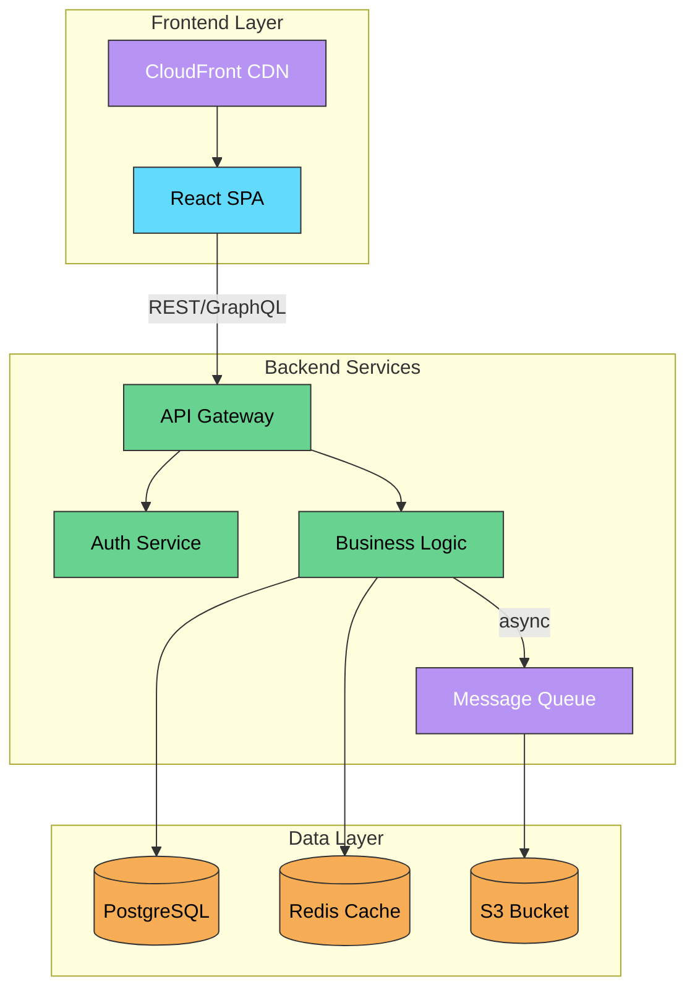

# Flowchart Reference

## Contents
- [Declaration](#declaration)
- [Classic Node Shapes](#classic-node-shapes)
- [New Shapes v11.3.0+](#new-shapes-v1130)
- [Icon and Image Nodes](#icon-and-image-nodes)
- [Edge Types](#edge-types)
- [Subgraphs](#subgraphs)
- [Styling](#styling)
- [Interactions](#interactions)
- [Pitfalls](#pitfalls)
- [Example](#example)

## Declaration

```
flowchart TD
```

`flowchart` or `graph`. Directions: `TB`/`TD` (top-down), `BT` (bottom-up), `LR` (left-right), `RL` (right-left).

## Classic Node Shapes

| Shape | Syntax | Description |
|-------|--------|-------------|
| Rectangle | `A["text"]` or `A[text]` | Default |
| Rounded | `A("text")` | Rounded corners |
| Stadium | `A(["text"])` | Pill shape |
| Subroutine | `A[["text"]]` | Double-bordered |
| Cylinder | `A[("text")]` | Database |
| Circle | `A(("text"))` | Circle |
| Asymmetric | `A>"text"]` | Flag-like |
| Diamond | `A{"text"}` | Decision |
| Hexagon | `A{{"text"}}` | Hexagon |
| Parallelogram | `A[/"text"/]` | Slanted right |
| Parallelogram alt | `A[\"text"\]` | Slanted left |
| Trapezoid | `A[/"text"\]` | Wide top |
| Trapezoid alt | `A[\"text"/]` | Wide bottom |
| Double circle | `A((("text")))` | Outer ring |

## New Shapes (v11.3.0+)

Generic syntax: `nodeId@{ shape: shapeName, label: "text" }`

| Name | Identifier | Visual |
|------|-----------|--------|
| Process | `rect` | Rectangle |
| Event / Rounded | `rounded` | Rounded rectangle |
| Terminal Point | `stadium` | Stadium/pill |
| Decision | `diam` | Diamond |
| Prepare Conditional | `hex` | Hexagon |
| Start | `circle` | Circle |
| Small Start | `sm-circ` | Small circle |
| Stop | `dbl-circ` | Double circle |
| Stop (framed) | `fr-circ` | Framed circle |
| Database | `cyl` | Cylinder |
| Direct Access Storage | `h-cyl` | Horizontal cylinder |
| Disk Storage | `lin-cyl` | Lined cylinder |
| Document | `doc` | Document shape |
| Lined Document | `lin-doc` | Lined document |
| Multi-Document | `docs` | Stacked documents |
| Tagged Document | `tag-doc` | Document with tag |
| Subprocess | `fr-rect` | Framed rectangle |
| Tagged Process | `tag-rect` | Rectangle with tag |
| Multi-Process | `st-rect` | Stacked rectangles |
| Lined/Shaded Process | `lin-rect` | Lined rectangle |
| Divided Process | `div-rect` | Divided rectangle |
| Internal Storage | `win-pane` | Window pane grid |
| Extract | `tri` | Triangle |
| Manual File | `flip-tri` | Inverted triangle |
| Manual Input | `sl-rect` | Sloped rectangle |
| Manual Operation | `trap-t` | Trapezoid (top) |
| Priority Action | `trap-b` | Trapezoid (bottom) |
| Delay | `delay` | Half-rounded rectangle |
| Collate | `hourglass` | Hourglass |
| Display | `curv-trap` | Curved trapezoid |
| Stored Data | `bow-rect` | Bow-tie rectangle |
| Fork/Join | `fork` | Filled rectangle bar |
| Junction | `f-circ` | Filled circle |
| Summary | `cross-circ` | Crossed circle |
| Com Link | `bolt` | Lightning bolt |
| Bang | `bang` | Exclamation shape |
| Cloud | `cloud` | Cloud |
| Paper Tape / Flag | `flag` | Flag |
| Odd | `odd` | Odd shape |
| Card | `notch-rect` | Notched rectangle |
| Loop Limit | `notch-pent` | Notched pentagon |
| Comment Left | `brace` | Left curly brace |
| Comment Right | `brace-r` | Right curly brace |
| Comment Both | `braces` | Dual curly braces |
| Data I/O (right) | `lean-r` | Leans right |
| Data I/O (left) | `lean-l` | Leans left |
| Text Block | `text` | Plain text |

## Icon and Image Nodes

**Icon node** (requires registered icon pack):
```
A@{ shape: icon, icon: "fa:fa-check", form: "square", label: "Done", pos: "b", h: 48 }
```
`form`: `square`, `circle`, `rounded` (or omit for no background). `pos`: `t` (top) or `b` (bottom).

**Image node**:
```
A@{ img: "https://example.com/logo.png", label: "Logo", pos: "t", w: 60, h: 60, constraint: "on" }
```

## Edge Types

| Syntax | Description |
|--------|-------------|
| `A --> B` | Arrow |
| `A --- B` | Open link (no arrow) |
| `A -.-> B` | Dotted with arrow |
| `A -.- B` | Dotted no arrow |
| `A ==> B` | Thick with arrow |
| `A === B` | Thick no arrow |
| `A ~~~ B` | Invisible link (layout only) |
| `A --o B` | Circle end |
| `A --x B` | Cross end |
| `A <--> B` | Bidirectional |
| `A o--o B` | Bidirectional circles |
| `A x--x B` | Bidirectional crosses |

**Text on edges:**
```
A -->|"label text"| B
A -- "label text" --> B
```

**Longer edges** (span more ranks): `A ----> B`, `A -.....-> B`, `A ====> B`

**Edge IDs** (v11+): `e1@--> A --> B` then style with `class e1 animate`

## Subgraphs

```
subgraph id["Title"]
    direction LR
    A --> B
end
```

Subgraphs can be nested. Edges can connect to subgraph IDs. Direction can be set per subgraph.

## Styling

**Inline style:**
```
style nodeId fill:#f9f,stroke:#333,stroke-width:4px
```

**Class definition and application:**
```
classDef myClass fill:#f9f,stroke:#333,stroke-width:4px,color:#000
classDef default fill:#fff,stroke:#333
class A,B myClass
A:::myClass --> B
```

**Link styling by index:**
```
linkStyle 0 stroke:#ff3,stroke-width:4px,color:red
linkStyle default stroke:#333
```

**Curve types** (in config): `basis`, `bumpX`, `bumpY`, `cardinal`, `catmullRom`, `linear`, `monotoneX`, `monotoneY`, `natural`, `step`, `stepAfter`, `stepBefore`

## Interactions

```
click A href "https://example.com" _blank
click A callback "Tooltip text"
click A call functionName()
```

Requires `securityLevel: 'loose'` for callbacks. Target: `_self`, `_blank`, `_parent`, `_top`.

## Pitfalls

- `end` as node text: Must capitalize (`End`, `END`) or use quotes
- `o` or `x` as first character of connecting node: Add space or capitalize
- Special characters in node text: Use quotes `["text with (parens)"]`

## Example


