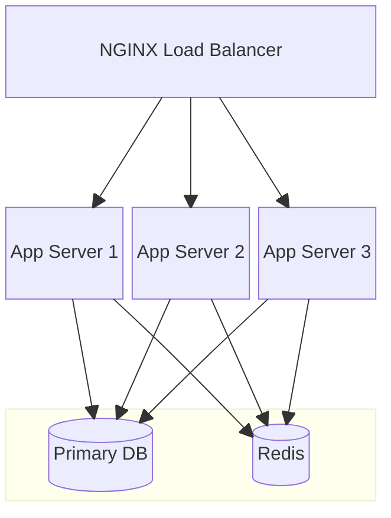
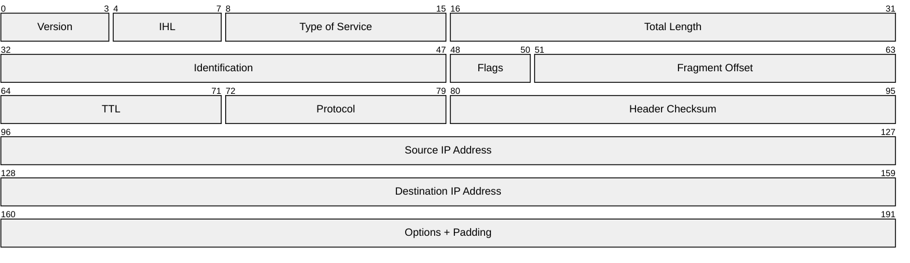
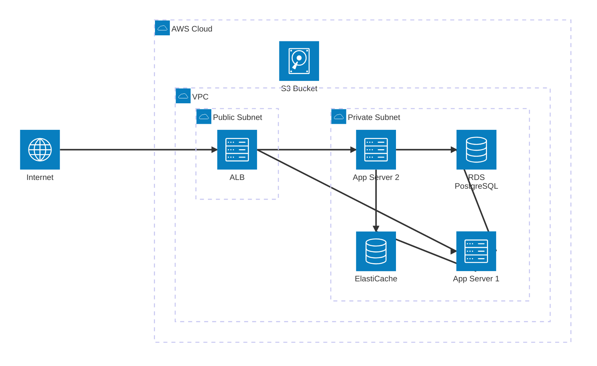
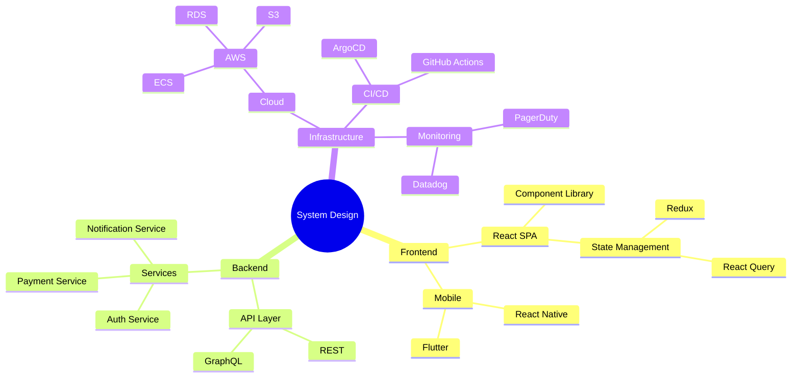
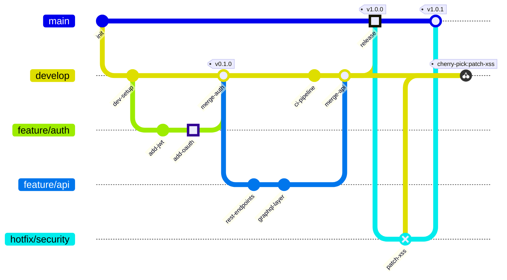

# Layout and Structural Diagrams Reference

## Contents
- [Block Diagram](#block-diagram)
- [Packet Diagram](#packet-diagram)
- [Architecture Diagram](#architecture-diagram)
- [Mindmap](#mindmap)
- [Gitgraph](#gitgraph)

---

# Block Diagram

## Declaration

```
block-beta
```

## Syntax

```
block-beta
    columns 3
    A["Service A"]:2 B["Service B"]
    C["Database"]:3

    A --> B
    B --> C
```

## Columns

```
columns N
```

Controls grid layout. Blocks fill left-to-right, wrapping to new rows.

## Block Width (Column Span)

```
A["Wide Block"]:2    %% spans 2 columns
B["Full Width"]:3    %% spans all 3 columns
```

## Block Shapes

Same as flowchart: `A["text"]` (rect), `A("text")` (rounded), `A(["text"])` (stadium), `A[["text"]]` (subroutine), `A[("text")]` (cylinder), `A(("text"))` (circle), `A{"text"}` (diamond), `A{{"text"}}` (hexagon), `A((("text")))` (double circle), `A>"text"]` (asymmetric).

## Nested/Composite Blocks

```
block-beta
    columns 2
    block:group1
        columns 1
        A["Inner A"]
        B["Inner B"]
    end
    C["Outer C"]
```

## Space Blocks

```
space          %% single empty cell
space:2        %% spans 2 cells
```

## Edges

```
A --> B            %% arrow
A --- B            %% line
A -->|"label"| B   %% labeled arrow
```

## Styling

```
style A fill:#f96,stroke:#333
classDef blue fill:#0ea,stroke:#333
class A blue
```

## Example



---

# Packet Diagram

## Declaration

```
packet-beta
```

## Syntax

```
packet-beta
    0-15: "Source Port"
    16-31: "Destination Port"
    32-63: "Sequence Number"
    64-95: "Acknowledgment Number"
```

Format: `start-end: "Field Name"` or `position: "Field Name"` (single bit).

## Automatic Positioning (v11.7.0+)

```
packet-beta
    +16: "Source Port"
    +16: "Destination Port"
    +32: "Sequence Number"
```

`+count` auto-calculates from previous field. Can mix with manual ranges.

## Configuration

| Option | Default | Description |
|--------|---------|-------------|
| `bitsPerRow` | 32 | Bits per row |
| `bitWidth` | 20 | Pixel width per bit |
| `rowPadding` | 10 | Row spacing |
| `rowHeight` | 48 | Row height |
| `showBits` | true | Display bit numbers |

## Example



---

# Architecture Diagram

## Declaration

```
architecture-beta
```

## Groups

```
group api(cloud)[API Layer]
group db(database)[Data Layer] in api
```

Format: `group id(icon)[label]`. Nesting via `in parentId`.

## Services

```
service web(server)[Web Server] in api
service cache(database)[Redis Cache]
```

Format: `service id(icon)[label]`. Optional `in groupId`.

## Edges

```
web:R --> L:cache
db:T --> B:api
```

Format: `sourceId:direction arrow direction:targetId`

Directions: `T` (top), `B` (bottom), `L` (left), `R` (right)

Arrows: `-->` (right), `<--` (left), `<-->` (bidirectional)

**Group edges**: `server{group}:B --> T:subnet{group}`

## Junctions

```
junction junctionId
junction junctionId in groupId
```

Four-way connection points for complex routing.

## Built-in Icons

`cloud`, `database`, `disk`, `internet`, `server`

## Extended Icons (Iconify)

Format: `packname:iconname` (e.g., `logos:aws`, `devicon:redis`). Requires icon pack registration.

## Example



---

# Mindmap

## Declaration

```
mindmap
```

## Syntax (Indentation-Based)

```
mindmap
    root((Central Idea))
        Branch A
            Leaf 1
            Leaf 2
        Branch B
```

Hierarchy by relative indentation. Consistent relative depth required.

## Node Shapes

| Shape | Syntax | Description |
|-------|--------|-------------|
| Default | `text` | Rounded rectangle |
| Square | `[text]` | Square brackets |
| Rounded | `(text)` | Parentheses |
| Circle | `((text))` | Double parentheses |
| Bang | `))text((` | Exploding/emphasis |
| Cloud | `)text(` | Cloud shape |
| Hexagon | `{{text}}` | Hexagon |

## Icons

```
Node ::icon(fa fa-star)
```

Requires registered icon font.

## Classes

```
Node:::className
```

## Markdown

`**bold**`, `*italic*` supported within nodes.

## Layout

Config: `layout: tidy-tree` for alternative layout.

## Example



---

# Gitgraph

## Declaration

```
gitGraph
```

Orientations: `gitGraph LR` (default), `gitGraph TB`, `gitGraph BT`

## Commands

**Commit:**
```
commit
commit id: "abc123"
commit id: "feature-x" type: HIGHLIGHT tag: "v1.0"
commit id: "revert" type: REVERSE
```

Types: `NORMAL` (solid circle), `HIGHLIGHT` (filled rectangle), `REVERSE` (crossed circle)

**Branch:**
```
branch develop
branch feature/login order: 2
```

`order` controls visual positioning.

**Checkout / Switch** (interchangeable):
```
checkout develop
switch main
```

**Merge:**
```
merge develop
merge feature/login id: "merge-feat" tag: "v2.0" type: HIGHLIGHT
```

**Cherry-pick:**
```
cherry-pick id: "abc123"
cherry-pick id: "abc123" parent: "parent-id"
```

## Configuration

| Option | Default | Description |
|--------|---------|-------------|
| `showBranches` | true | Display branch labels |
| `showCommitLabel` | true | Display commit IDs |
| `mainBranchName` | "main" | Default branch name |
| `mainBranchOrder` | 0 | Visual position |
| `parallelCommits` | false | Align same-level |
| `rotateCommitLabel` | true | 45-degree rotation |

## Theme Variables

Branch colors: `git0`-`git7`. Branch labels: `gitBranchLabel0`-`gitBranchLabel7`. Commit: `commitLabelColor`, `commitLabelBackground`, `commitLabelFontSize`. Tags: `tagLabelColor`, `tagLabelBackground`, `tagLabelBorder`.

## Example


