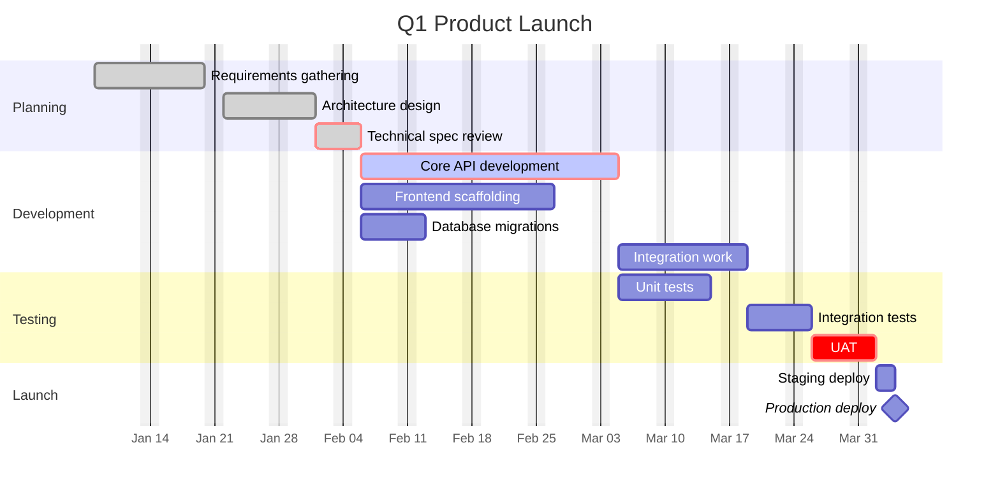
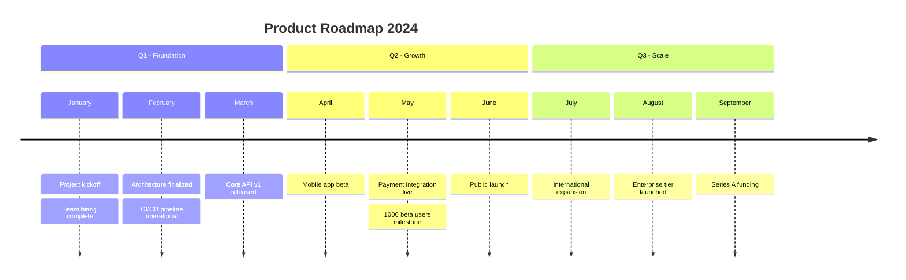
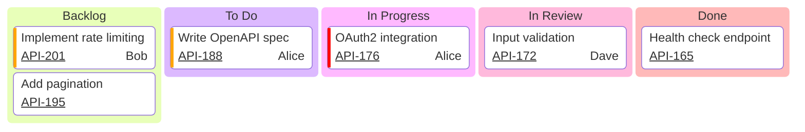
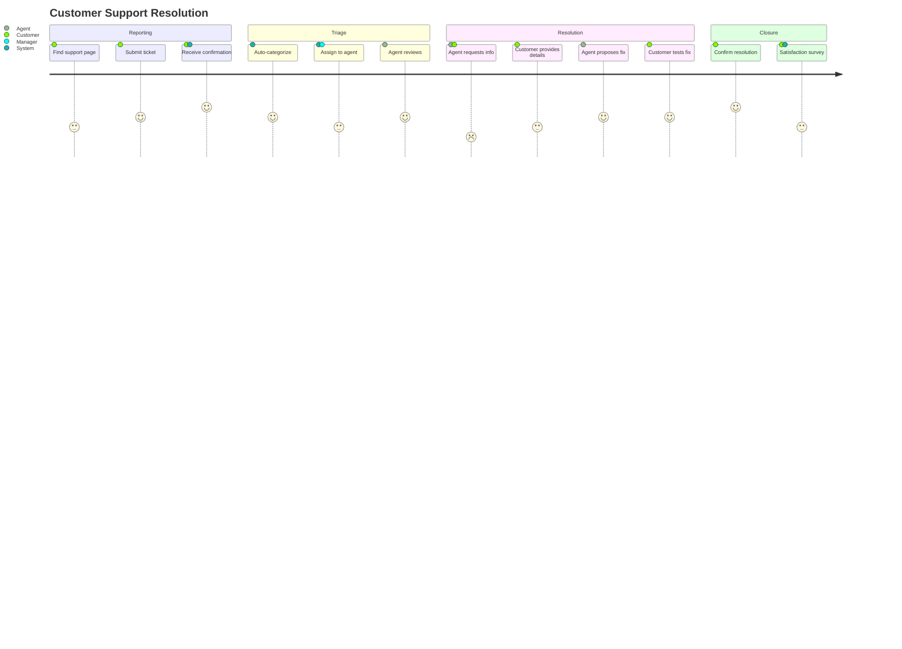

# Project Planning Diagrams Reference

## Contents
- [Gantt Chart](#gantt-chart)
- [Timeline](#timeline)
- [Kanban Board](#kanban-board)
- [User Journey](#user-journey)
- [Requirement Diagram](#requirement-diagram)

---

# Gantt Chart

## Declaration

```
gantt
```

## Structure

```
gantt
    title Project Timeline
    dateFormat YYYY-MM-DD
    axisFormat %Y-%m-%d
    excludes weekends

    section Phase 1
    Task 1 : taskId1, 2024-01-01, 30d
    Task 2 : after taskId1, 15d
```

## Date Formats

**Input (`dateFormat`)**: Default `YYYY-MM-DD`. Tokens: `YYYY`, `YY`, `MM`, `M`, `DD`, `D`, `HH`, `H`, `mm`, `m`, `ss`, `s`, `Z`

**Output (`axisFormat`)**: Default `%Y-%m-%d`. Tokens: `%a` (weekday abbr), `%A` (weekday full), `%b` (month abbr), `%B` (month full), `%d` (day), `%H` (hour 24h), `%m` (month num), `%M` (minute), `%Y` (year 4-digit), `%y` (year 2-digit)

## Task Syntax

```
Task name : [tags], [taskId], [startDate], [endDate/duration]
```

**Tags** (optional, comma-separated, placed first):
- `done` - Completed
- `active` - In progress
- `crit` - Critical path
- `milestone` - Single point (duration = 0)

**Start**: Explicit date, `after taskId`, `after task1 task2 task3` (multiple deps)

**End**: Explicit date, duration (`30d`, `2w`, `1h`, `30min`), `until otherTaskId` (v10.9.0+)

Tasks without explicit start begin after the previous task.

## Sections

```
section Section Name
```

Groups tasks visually.

## Excludes

```
excludes weekends
excludes sunday
excludes 2024-12-25, 2024-01-01
```

Custom weekend (v11.0.0+): `weekend friday`

## Vertical Markers (v11.0.0+)

```
vert 2024-06-15
```

## Tick Interval

```
tickInterval 1week
```

Options: `1day`, `1week`, `1month`, etc.

## Compact Mode

Config: `gantt: { displayMode: compact }` - Multiple tasks per row when non-overlapping.

## Click Events

```
click taskId href "https://example.com"
click taskId call functionName()
```

## Today Marker

Config: `todayMarker: "stroke-width:5px,stroke:#0f0"` or `todayMarker: off`

## Configuration

| Option | Default | Description |
|--------|---------|-------------|
| `barHeight` | 20 | Task bar height |
| `barGap` | 4 | Space between bars |
| `topPadding` | 50 | Top margin |
| `fontSize` | 11 | Text size |
| `numberSectionStyles` | 4 | Color rotation count |
| `displayMode` | normal | `normal` or `compact` |

## Example



---

# Timeline

## Declaration

```
timeline
```

## Syntax

```
timeline
    title History of Web Development
    section Early Web
        1991 : Tim Berners-Lee creates WWW
        1993 : Mosaic browser released
             : HTML 2.0 specification
    section Dynamic Web
        1995 : JavaScript invented
             : PHP released
```

Format: `time period : event`. Multiple events per period using continuation lines with `:`.

## Sections

```
section Section Name
```

Each section gets a distinct color scheme.

## Styling

- Without sections: Each period gets individual colors
- `disableMulticolor: false` for uniform styling
- Theme variables: `cScale0`-`cScale11` (backgrounds), `cScaleLabel0`-`cScaleLabel11` (text)

## Example



---

# Kanban Board

## Declaration

```
kanban
```

## Syntax

```
kanban
    todo[To Do]
        task1[Design API schema]
        task2[Write migration scripts]
    inprogress[In Progress]
        task3[Implement auth endpoints]
    done[Done]
        task4[Setup CI/CD pipeline]
```

Columns: `columnId[Column Title]`. Tasks indented under columns: `taskId[Task Description]`.

## Task Metadata

```
taskId[Task Description]@{ assigned: "Alice", ticket: "PROJ-42", priority: "High" }
```

Keys: `assigned`, `ticket`, `priority` (`Very High`, `High`, `Low`, `Very Low`)

## Ticket URL Configuration

```
---
config:
  kanban:
    ticketBaseUrl: 'https://jira.example.com/browse/#TICKET#'
---
```

`#TICKET#` replaced with the ticket value.

## Example



---

# User Journey

## Declaration

```
journey
```

## Syntax

```
journey
    title User Onboarding Experience
    section Discovery
        Visit landing page: 5: User
        Read features: 4: User
    section Signup
        Create account: 3: User
        Verify email: 2: User, System
```

Format: `Task name: score: actor1, actor2`

- **Score**: 1 (worst) to 5 (best) -- satisfaction/experience quality
- **Actors**: Comma-separated participants

## Styling

Theme variables `fillType0`-`fillType7` for section colors.

## Example



---

# Requirement Diagram

## Declaration

```
requirementDiagram
```

## Requirement Types

```
requirement UserAuth {
    id: REQ-001
    text: System shall authenticate users via OAuth2
    risk: High
    verifymethod: Test
}
```

Types: `requirement`, `functionalRequirement`, `interfaceRequirement`, `performanceRequirement`, `physicalRequirement`, `designConstraint`

Risk: `Low`, `Medium`, `High`

Verification: `Analysis`, `Inspection`, `Test`, `Demonstration`

## Elements

```
element WebApp {
    type: Application
    docref: https://docs.example.com/webapp
}
```

## Relationships

```
UserAuth - traces -> SessionMgmt
WebApp - satisfies -> UserAuth
TestSuite - verifies -> UserAuth
```

Direction: `- type ->` or `<- type -`

Types: `contains`, `copies`, `derives`, `satisfies`, `verifies`, `refines`, `traces`

## Example

```mermaid
requirementDiagram

    requirement DataEncryption {
        id: SEC-001
        text: All data at rest must be encrypted with AES-256
        risk: High
        verifymethod: Inspection
    }

    functionalRequirement APIAuth {
        id: SEC-002
        text: API endpoints must require JWT authentication
        risk: High
        verifymethod: Test
    }

    performanceRequirement ResponseTime {
        id: PERF-001
        text: API responses within 200ms p99
        risk: Medium
        verifymethod: Test
    }

    element BackendService {
        type: Microservice
        docref: https://docs.example.com/backend
    }

    element LoadTest {
        type: Test Suite
        docref: https://ci.example.com/loadtest
    }

    BackendService - satisfies -> DataEncryption
    BackendService - satisfies -> APIAuth
    APIAuth - derives -> DataEncryption
    LoadTest - verifies -> ResponseTime
```
