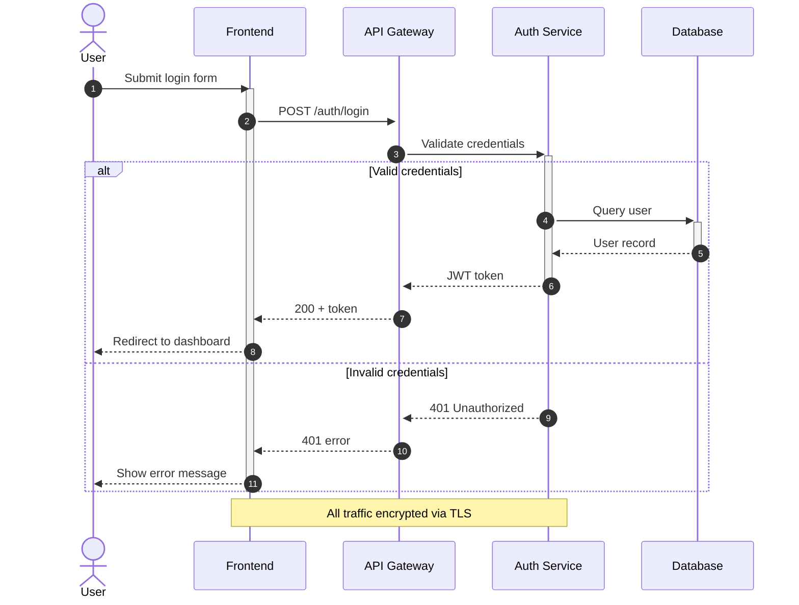

# Sequence Diagram Reference

## Contents
- [Declaration](#declaration)
- [Participants and Actors](#participants-and-actors)
- [Message Types](#message-types)
- [Activation](#activation)
- [Notes](#notes)
- [Boxes](#boxes)
- [Control Flow](#control-flow)
- [Background Highlighting](#background-highlighting)
- [Create and Destroy](#create-and-destroy)
- [Sequence Numbers](#sequence-numbers)
- [Actor Links](#actor-links)
- [Configuration](#configuration)
- [Example](#example)

## Declaration

```
sequenceDiagram
```

## Participants and Actors

```
participant A as Alice
actor B as Bob
```

**Specialized shapes:**
```
participant A as Alice             %% rectangle (default)
actor B as Bob                     %% stick figure
participant C as boundary          %% boundary box
participant D as control           %% control circle
participant E as entity            %% entity underline
participant F as database          %% database cylinder
participant G as collections       %% stacked boxes
participant H as queue             %% queue shape
```

Participants appear in declaration order (or first-mention order if implicit).

## Message Types

| Syntax | Style |
|--------|-------|
| `A->B` | Solid line, no arrow |
| `A-->B` | Dotted line, no arrow |
| `A->>B` | Solid line, arrowhead |
| `A-->>B` | Dotted line, arrowhead |
| `A<<->>B` | Solid bidirectional |
| `A<<-->>B` | Dotted bidirectional |
| `A-xB` | Solid line, cross end |
| `A--xB` | Dotted line, cross end |
| `A-)B` | Solid async (open arrow) |
| `A--)B` | Dotted async (open arrow) |

Message text after colon: `A->>B: Hello`

## Activation

```
activate A
deactivate A
```

Shorthand: `A->>+B: Request` (activate B), `B-->>-A: Response` (deactivate B). Stacking supported.

## Notes

```
Note right of A: Text
Note left of A: Text
Note over A: Text
Note over A,B: Spanning note
```

Line breaks with `<br/>`.

## Boxes (Grouping Participants)

```
box Aqua "Group Label"
    participant A
    participant B
end
```

Background: color name, `rgb(r,g,b)`, `transparent`.

## Control Flow

**Loop:**
```
loop Every minute
    A->>B: Heartbeat
end
```

**Alt/Else:**
```
alt Success
    A->>B: 200 OK
else Failure
    A->>B: 500 Error
else Timeout
    A->>B: 408 Timeout
end
```

**Opt (optional):**
```
opt Extra logging
    A->>B: Log event
end
```

**Par (parallel):**
```
par Database query
    A->>B: Query
and Cache check
    A->>C: Check
and Log
    A->>D: Record
end
```

**Critical:**
```
critical Establish connection
    A->>B: Connect
option Network down
    A->>A: Retry
option Timeout
    A->>A: Abort
end
```

**Break:**
```
break When quota exceeded
    A->>B: 429 Rate Limited
end
```

## Background Highlighting

```
rect rgb(200, 220, 255)
    A->>B: Within highlight
end
rect rgba(0, 0, 255, 0.1)
    B->>C: Semi-transparent
end
```

## Create and Destroy

```
create participant C
A->>C: Spawn
destroy C
B-xC: Kill
```

## Sequence Numbers

Config: `showSequenceNumbers: true` or add `autonumber` at diagram start.

## Actor Links

```
link A: Dashboard @ https://dashboard.example.com
links A: {"Docs": "https://docs.example.com", "API": "https://api.example.com"}
```

## Configuration

| Option | Default | Description |
|--------|---------|-------------|
| `mirrorActors` | true | Show actors at bottom too |
| `wrap` | false | Wrap long text |
| `showSequenceNumbers` | false | Number messages |
| `messageAlign` | center | left/center/right |
| `actorMargin` | 50 | Space between actors |
| `noteMargin` | 10 | Note padding |
| `messageFontSize` | 16 | Message text size |
| `width` | 150 | Actor box width |
| `height` | 65 | Actor box height |

## Example


